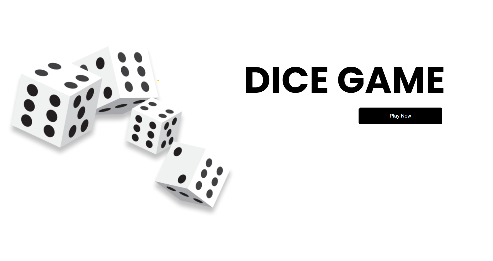
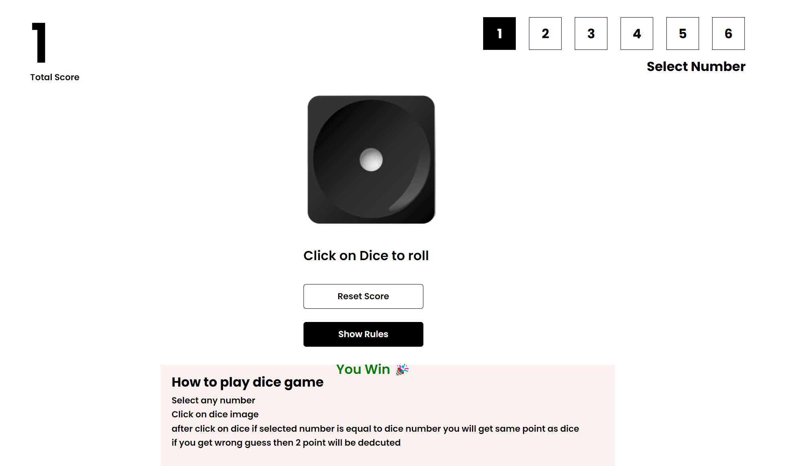

<h1>Dice Game in React</h1>

This is a simple dice game built using React, where player can take turns rolling a dice. The player win if the selected number and dice matches and get points. This project serves as a fun and educational introduction to React and web development.

